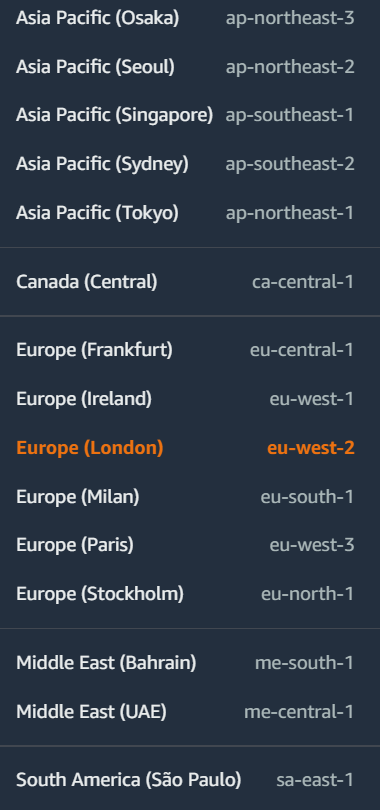
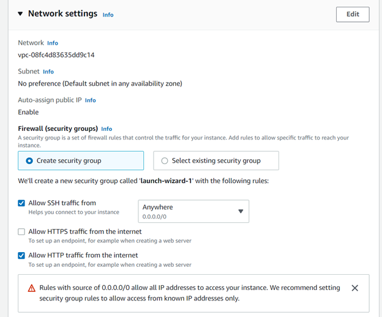

#  Лабораторна робота №5.
## Деплой проекту на AWS EC2.
## Грига Михайло Михайлович <br> ІПЗ1.1
## План:
1) Зареєструватись на AWS. 
2) Створити інстанс EC2.
3) Задеплоїти проект (може бути  html сторінка) і скинути посилання в звіт для можливості перегляду.

### Для початку я перейшов на сторінку https://portal.aws.amazon.com/billing/signup#/start/email і зареєструвався. Уже на головній сорінці зверху зправа я вибрав регіон в якому буде створений сервер(потрібно вибирати той, що ближче до мене).



### Далі в пошуку я прописав і перейшов на сторінку EC2.


### Після цього натиснув на кнопку Launch instanse
### Дав назву для instanse. Зробив ключ, який відразу скачався.


### Також поставив галочку біля allow HTTP traffic from the internet у Network settings. Всі інші налаштування залишив за замовчуванням.



### Натиснув кнопку Launch instance і як можна побачити він відразу запустився.


### Після цього я відкрив термінал Ubuntu в папці з ключем. Натиснувши кнопку Connect в інстансі, я скористався інструкцією яку побачив, а саме прописав команди:
```
    chmod 600 keyy.pem
    ssh -i "keyy.pem" ubuntu@ec2-18-132-45-132.eu-west-2.compute.amazonaws.com
```


### Таким чином я підключився до терміналу віддаленого убунту. Тепер я прописав команди щоб оновити пакети та встановити Apache HTTP Server.
```
    sudo apt update
    sudo apt upgrade
    sudo apt install apache2
    sudo ufw allow in "Apache Full"
    sudo systemctl restart apache2
```


### Створивши проект(html сторінку), я стиснув його в zip і відправив до віддаленого убунту.


### Повернувшись на віддалене убунту, я розархівував index файл і перезаписав файл index.html в папці /var/www/html/.


### Після цього я перейшов по адресі, яка вказана в тій же вкладці Connect і мені відкрилась моя сторінка.


