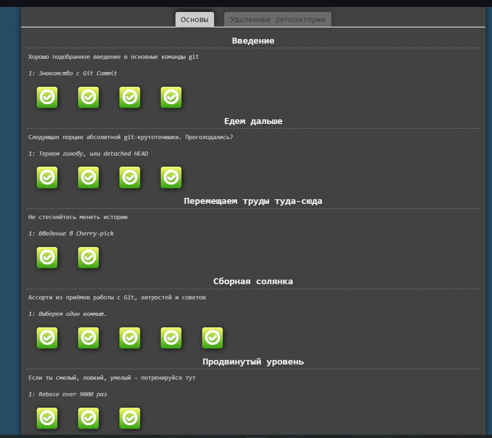
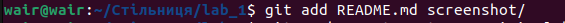

#  Лабораторна робота №2.
## Основні команди системи контролю версій Git.
## Грига Михайло Михайлович <br> ІПЗ1.1
## План:
1) Пройти гру Git Learn та зробити скріншоти пройдених рівнів.
2) Зробити git init папки із файлом hello.txt та bash скриптом.
3) Зробити git commit.
4) Зробити git push у віддалений репозиторій у вітку lab_works_one_two.
5) Додати в папку Readme файл із звітом до лабораторної, щоб його можна було передивлятись на репозиторію коли переходиш у вітку.

### Скріншоти пройдених рівнів.


### Створив локальний репозиторій із файлами hello.txt та bash скриптом.
```
    git init
```

### Додав всі елементи в staging area і зробив commit
```
    git add .
    git commit -m"add hello.txt and script.sh"
```

### Створив нову вітку lab_works_one_two і відразу перейшов до неї.
```
    git checkout -b "lab_works_one_two"
```

### Підключився до віддаленого репозиторію.
```
    git remote add origin git@github.com:1337WAIR/Lab_OS.git
```

### Зробив git push у віддалений репозиторій у вітку lab_works_one_two.
```
    git push --set-upstream origin lab_works_one_two
```

### Добавив README.md зі звітом і папку зі скріншотами, зробив комміт і запушив у вітку lab_works_one_two.
```
    git add README.md screnshot/
```

```
    git commit -m"add screnshot and README.md"
    git push --set-upstream origin lab_works_one_two
```
