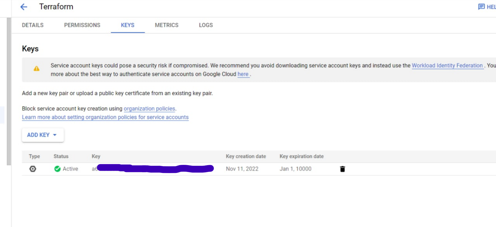
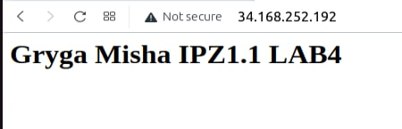

#  Лабораторна робота №4.
## Грига Михайло Михайлович <br> ІПЗ1.1
## Terraform
### План


### Спочатку я зареєструвався в google cloud. Після налаштувань облікового запису я створив запис для служб.


### Вибрав роль project owner.


### Після цього я створив ключ в форматі json.



### Перейшовши у вкладку з образами віртуальних машин, запустив computing engines.


### Тепер все було підготовлене до створення проекту. Для початку я створив папку куди переніс ключ, також добавив файл з розширенням .tf. В цьому файлі я прописав назву ключа, id проекту, створив 2 ресурси і підключив АРІ googlecompute i cloudresourcemanager, а також прописав порти.


### Також, я вказав тип віртуальної машини та прописав скрипт. За допомогою скрипту я встановлюю Apache Server та в індексу сторінку переніс свої данні.


### Тепер я проініціалізував проект.
```
    terraform init
```


### Запустив його.
```
    terraform apply
```


### Перейшовши по ip бачу результат.


